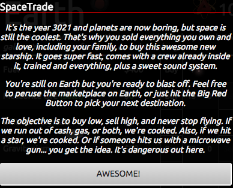
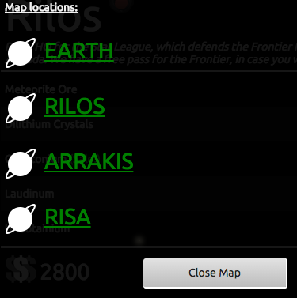
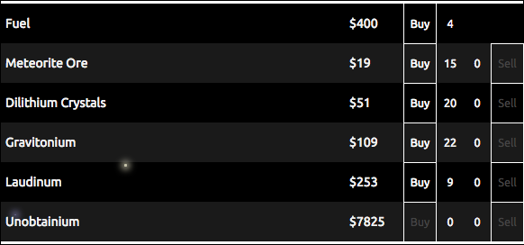
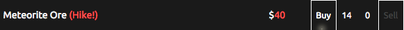
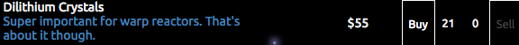
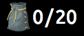
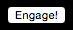
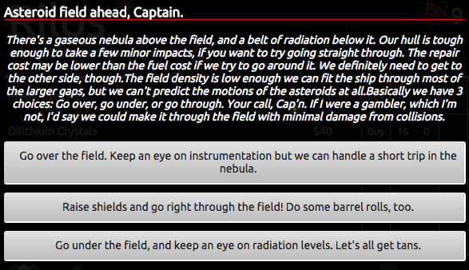

# SpaceTrade

*Caveat: This is currently a work-in-progress (including the name),
and should not be taken as an example of optimized code.
Screenshots included in this doc may not be accurate as development
continues, but I will try to update them as much as possible/necessary.*

## What is it? _(The Gist)_
It's a game! If you've ever played
[Drugwars or DopeWars](http://en.wikipedia.org/wiki/Drugwars),
you're probably familiar with the genres of resource-management and
turn-based games. This is a web-based port with a space-themed twist,
where you buy low and sell high until you can't fly no more. Crazy
stuff happens in space though, so watch out.

## What do I do? _(Mechanics)_
- Buy stuff with cash
- Sell stuff for more cash
- Travel from port to port
- Keep fuel in your tank at all times
- Upgrade your cargo hold to... hold more cargo
- Take advantage of sales and price hikes
- Navigate the random events that may occur when you travel
- Try to keep Dobson alive

**The game is over** when you end up with no fuel AND at
a port that doesn't sell fuel. If you end up with no fuel,
at a port that DOES sell fuel, but you have no money to buy fuel,
**the game is also over**.

Your final score is calculated by the equation:

`(# turns taken + number of cargo upgrades) *
(final cash amount + value of final owned goods)`

## What else does it do? _(Existing Features)_
_New stuff is being added all the time, but the general features below
are what drive the majority of the game._

#### The Map and Market
***

The Big Red Button next to your current location opens the map.

Clicking a map location (port) will instantly teleport you there, with a chance
for a random event to occur on the way (more on those later).
At this point in development, every port buys/sells the same goods.

Each item in the market has a price and a stock level (the port's inventory).
Every time you travel, the prices and stock level for each item fluctuate.

Certain ports also sell special items, like fuel or cargo upgrades,
and stock/prices for those items do not fluctuate between visits
(so port A always has X fuel at price $Y).

For non-special items, the amount of stock fluctuates within a certain range
each visit, and the range is specific to that particular port.

The prices change depending on the port, each of which have their own "flux" level.
Sales and price hikes occur randomly at every port, and their possible
ranges (how low/high the prices may get) are determined by the port as well.

Unobtanium is a special item that no one sells, but everyone will buy.
The asking price is always high, sometimes astronomical (zing), so keep
an eye out for it in your travels because you'll be the only one who ever has it
(wait, what?).

You can always click on elements of the UI for more information, too.

#### Fuel, Cash, and Cargo
***

Every travel costs 1 fuel. Only certain ports sell fuel, so be careful
where you travel to when you only have 1 fuel left.

Cash is universal, so there are no currency conversion or alternate payment
options anywhere in the Universe (it's universal, I just said that).

Your cargo (the number on the left) obviously fluctuates whenever you buy or
sell goods. The number on the right is your cargo capacity, the total number of items
you are able to hold at one time. Certain ports offer upgrades to add to your
cargo capacity, and certain event outcomes may boost it even further.

#### The "Engage" Button
***

This kicks you from impulse to warp speed, or from warp to impulse.
Doing so has no purpose other than looking cool.

#### The Random Events
***

Whenever you click a location on the map (other than your current location),
that's considered a "travel". Every time you travel, there is a pre-defined chance
for you to encounter a random event before you arrive at your destination. The odds
start at 30% chance of an event occurring, and increase by 10% every 10 times you
travel.

Odds are not currently being cached, so it's X% chance for an event
_each time you travel_.
So even with 75% odds, you could travel 10 times and encounter 0-10 events,
depending on your luck. Encountering 0 would just mean you have terrible, terrible,
terrible luck. Make sense?

Each event has a title, a description, a random line of advice (one of three)
from your first officer, and three possible choices to make. They aren't your
usual Good/Neutral/Bad decisions, and the advice isn't always Safe/Curious/Crazy.
The outcomes from each decision can be all bad, all good, or a mix of
bad/good/neutral. Sometimes you get fuel, sometimes you lose goods; sometimes Dobson
dies, sometimes you look down and your pants are on backwards. It's crazy.
The point is, even if you think you know what's going to happen when
you click that button, you probably don't. Unless, ya know, you've played before.

## What's planned for the future? _(Upcoming Features)_
- As you take more turns / travel...
 - Unlock lots (~100) more random events
 - Unlock 3 more maps (new collections of locations)
 - Unlock 2 more menus (new collections of items for sale)
 - Different tiers of event difficulties occur
 - More upgrades to ship (cargo hold, fuel consumption, ???)
- Personal high score caching
- Better graphics
- A Quit button for Quitters
- Bonus points for finishing with Dobson alive
- Slightly less bonus points if Dobson dies multiple times

## What's it made of? _(Nerd Stuff)_

Currently, the only external resource that drives the game
is [jQuery](http://jquery.com/).
The rest is just HTML, CSS, and a little vanilla JS. Honestly I'd like to 
keep it that way, but with the addition of my custom
[starfield background](https://github.com/Drewpeifer/demo/tree/master/space),
I decided to include the awesome library
[transit.js](http://ricostacruz.com/jquery.transit/),
which made CSS animations much more concise and legible, while preserving
cross-browser compatibility.

I also took advantage of CSS3 in modern
browsers with some `@media` calls, and I do a little UserAgent sniffing in case
there are quirks, but for the most part the code is
browser-agnostic as long as JavaScript is enabled. 